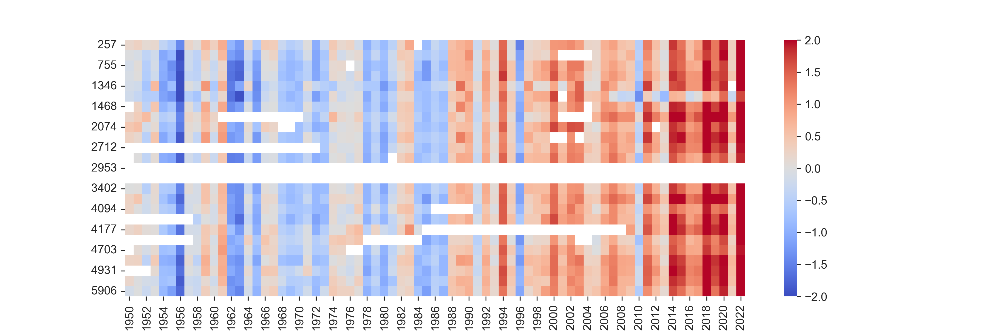

# Exercise 1: Warming Stripes Analysis using Python and Jupyter Notebook

## Overview
This exercise involved creating a series of warming stripes diagrams to visually represent the change in annual temperatures at selected stations in Baden-Württemberg, Germany. The analysis was performed using the Jupyter Notebook from your github files as suggested.

## Sub-Task 1.1: Station Selection
Using **Pandas**, I processed the station description file [KL_Jahreswerte_Beschreibung_Stationen.txt](https://opendata.dwd.de/climate_environment/CDC/observations_germany/climate/annual/kl/historical/KL_Jahreswerte_Beschreibung_Stationen.txt) to select the relevant stations that met the following criteria:
1. Located in **Baden-Württemberg**.
2. **Active** weather stations.
3. **Operational before 1950**.

## Sub-Task 1.2: Geopackage Layer Creation
I used **geopandas** to create a **geopackage layer** with the selected stations [Warming_Stripes.ipynb](./Python/Warming_Stripes.ipynb).  The generated layer was then loaded into **QGIS**, where I incorporated the **Baden-Württemberg WMS** service with the **topographic map collection (DT50)** as a background. The stations were labeled with their respective station IDs and names, and the map was projected in **EPSG:25832** for proper spatial representation.

Relevant screenshots for selected steps:

The map produced:

## Sub-Task 1.3: Automatic Data Download
To automate the data retrieval process, I extended the notebook to download the **annual temperature data** for the selected stations from the [DWD KL Data Collection](https://opendata.dwd.de/climate_environment/CDC/observations_germany/climate/annual/kl/historical/) using the jupyter notebook provided

## Sub-Task 1.4: Warming Stripes Plot
Finally, using the downloaded data, I merged the temperature **time series** data for the selected stations into a single dataframe. The resulting plot covers the period from **1950 to 2022** and visualizes the annual temperature development at each selected station. The code was adapted from the example notebook `gdms0155_DWD_NRW_5_Warming_Stripes/gdms155_DWD_NRW_5_Warming_Stripes.ipynb`.

The two images are:

At the time I noticed the white big white empty stripe corresponding to station 2953 and played around to see where the problem was and it soon turned out the mean calculated over the period had the issue due to the fact that many empty readings were there .. Please refer back to the notebook [Warming_Stripes_images.ipynb](./Python/Warming_Stripes_images.ipynb)
## Folder Structure
The following folder structure was used for the exercise:

- **data**: Contains the station description file and downloaded temperature data.
- **Images**: Stores any visual output, including the generated warming stripes plots and QGIS maps.
- **Python**: Contains the Jupyter Notebook with the implemented solution.

