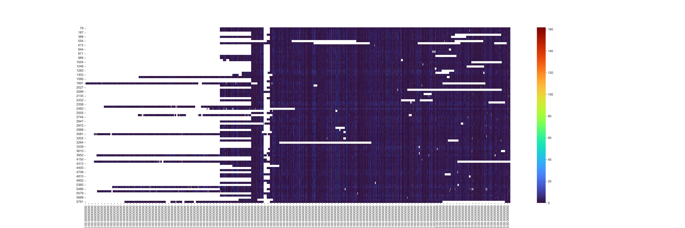
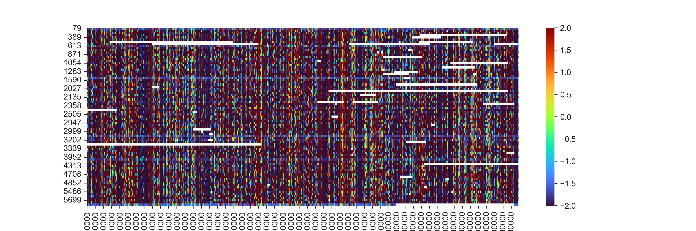

# Exercise 4: NRW Preciptation + QGIS Temporal Controller

## Overview

This task involved creating a plot similar to Exercise 1 but that of the preciptation while selecting the NRW state. I also created a spatio-temporal timeseries animation, similar to that of exercise 3, of that same daily preceptiation levels over time, leveraging the **QGIS Temporal Controller**.

## Other trials:

## Process

### 1. **Data Preparation and figures production**
   - Using **Pandas**, I processed the station description file [RR_Tageswerte_Beschreibung_Stationen.txt](https://opendata.dwd.de/climate_environment/CDC/observations_germany/climate/daily/more_precip/historical/RR_Tageswerte_Beschreibung_Stationen.txt) to select the relevant stations that met the following criteria:
1. Located in **Nordrhein-Westfalen**.
2. **Active** weather stations.
3. **Operational before 1950**.

## Geopackage Layer Creation

     I used **geopandas** to create a **geopackage layer** with the selected stations [Preciptation-Geopackage.ipynb](./Python/Preciptation-Geopackage.ipynb).  The generated layer was then loaded into **QGIS**, where I incorporated the **Nordrhein-Westfalen WMS** service with the **topographic map collection** as a background. The stations were labeled with their respective station IDs and names, and the map was projected in **EPSG:25832** for proper spatial representation.
[Preciptation-Geopackage.ipynb](./Python/Preciptation-Geopackage.ipynb)
[Nordrhein-Westfalen_Selected_Stations_from_Jupyter.gpkg](./data/Nordrhein-Westfalen_Selected_Stations_from_Jupyter.gpkg) 

## Warming Stripes Plot
Finally, using the downloaded data, I merged the preciptation **time series** data for the selected stations into a single dataframe.The code was adapted from the example notebook `gdms0155_DWD_NRW_5_Warming_Stripes/gdms155_DWD_NRW_5_Warming_Stripes.ipynb`. The resulting plot covers the period from **1950 to 2022** and visualizes the daily preciptation development at each selected station. 

The two images are:

I used the daily readings because with rain the changes can be much more volatile and quick to change.. You may notice that the lighter blue and more greenish colours on the left get less and less and gets darker bluer as you proceed to the right with time. Which states that the rain is getting rarer than before. You may also notice that the darker red appears more often in small stripes also the more you go right which indicates that the rain gets rarer but more severe events of rain where much more violent rain occurs.

Please refer back to the notebook [Preciptation.ipynb](./Python/Preciptation.ipynb)

### 2. **Temporal Visualization in QGIS**

I repeated all of the previous to concatenate all the data of readings from the stations so that I can create a timeseries video to show this change overtime between frequent normal rain and rare drier seasons but with violent rain events more often. [Preciptation-TimeSeries.ipynb](./Python/Preciptation-TimeSeries.ipynb)

I did face a lot of challenges cleaning the data in the previous steps and it also proved smart to use integer formats for the the station_id coloumns because they were formatted different between the station description file and the other data zip files of each station. In one my previous trials none of the 83 stations matched (because of the string "00079" comparison with "    79" for example). It took me a lot of time to fix these.

   - **QGIS Connection**: Established a connection between **QGIS** and and my local CSV files.
     

     

     
   - **Data Handling**: Loaded the preciptation data for visualization.
  

     
    
    
- **Temporal Controller**: Configured the **QGIS Temporal Controller** to animate the changes over time, starting from the earliest records (early 1950s) to the most recent data points.
     
- Added some graphical symbols to visually make more sense for the rain
         

- However (one of the challenges I faced) I could not use equal intervals I noticed that the mean was really close to the minimum in comparison to the maximum (I noticed when all rain was considered little). I then decided to use intervals of standard deviations for that matter.
   

- Another messed up mistake I did was not putting a different value for Zero so it always was raining until I put an invisible symbol value (opacity = 0%) for low to no rain.
     
 

- The Geopackage [Value_Attributed_Selected_Stations_from_Jupyter.gpkg](./data/Value_Attributed_Selected_Stations_from_Jupyter.gpkg) had to be removed because it was 400 mb in size. But it could easily be remade by joining 
   Nordrhein-Westfalen_Selected_Stations_from_Jupyter with time_series_NRW_prec csv files using their station_id as common by copying the following instructions ... you get this window from the "toolbox" and then "Vector General" and then "join attributes by field values"
   
   

   

       

### 3. **Video Creation**
   - **Image Export**: Last and most important mistake I have done was forget that I do not have a graphics card; it took me 6 hours to produce 700 pictures on some of the lowest quality and my laptop was on constant freeze ... it crashed few times and there was 4 main trials (You can see the directories Exporting 1-4 in the [Prec_Time.Series.Final](./Prec_Time.Series.Final) directory) and many small ones. Hence I had to stop at the two years 2020-2022 just to show the potential of what can be done by the qgis file attached in my exercise repository given with that temporal controller.
     
     
   - **Video Assembly**: Compiled the exported images into an **MPEG** video using the same Python script and was fairly not challenging.
     
Please refer back to [Time_Series_Video_Creator_V01_dev.ipynb](./Python/Time_Series_Video_Creator_V01_dev.ipynb) 

The final video:
[Prec_Time.Series.Final/video/timeseries_perc_Amrs_version.mp4](./Prec_Time.Series.Final/video)

[Download the video "timeseries_perc_Amrs_version.mp4"](./Prec_Time.Series.Final/video/timeseries_perc_Amrs_version.mp4)

## Folder Structure
The following folder structure was used for the exercise:

   
- **Prec_Time.Series.Final**:
   - **images**: Stores the exported images representing each time step and the video.
   - **video**: Has the desired output video; each second represents a year.
   - **Exporting 1-4**: all the failed trials
     
     

- **Data**: Contains the original datasets, including station locations and measurements. Has the style and the pictures used for symbols and the Geopackage. 
- **python**: Includes the jupyter notebooks and the Python scripts used to process the data and the images and create the final video.
- **QGIS**: Has the files with the layers needed.

